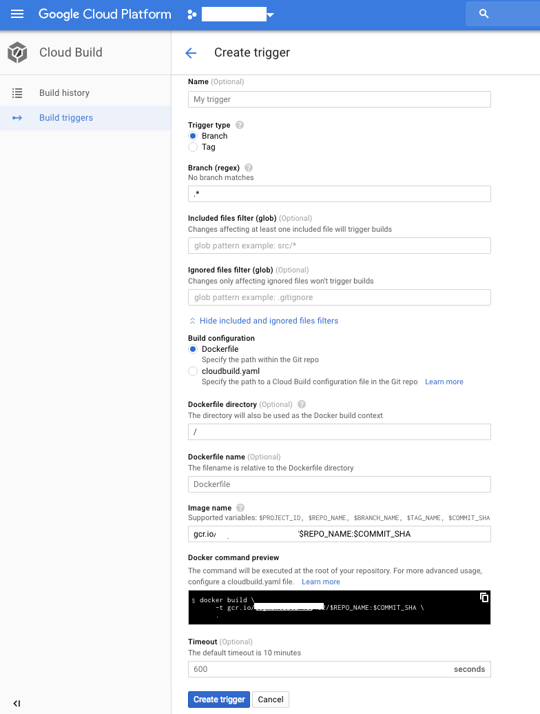
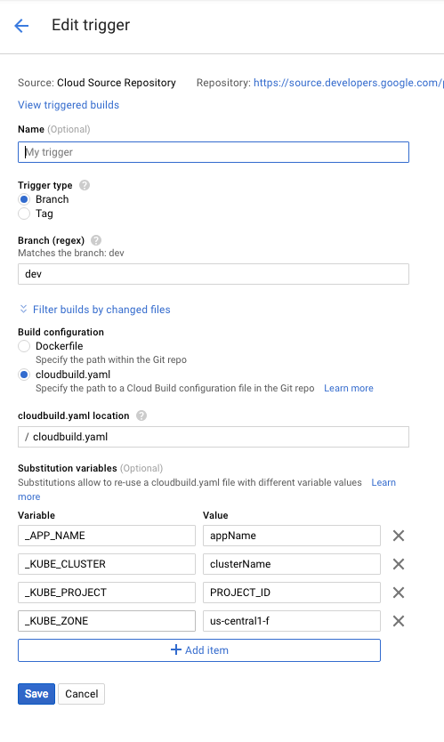

# Setup Kubernetes CI/CD for Backend Apps

There are multiple things we need to setup for setting up a pipeline for our backend codebase like setting up our environment variable, SSL certificate, Kubernetes Service, Ingress and the main thing which is deployment

Let's Start one by one for this

## Create Cluster

This is the main thing in which all the resources reside. Generally for every deployment environment create separate cluster. I will create cluster for dev environment inside GCP(Google Cloud)

First install gcloud from https://cloud.google.com/sdk/

Then install kubectl using command

`gcloud components install kubectl`

Once its done

Set GCP projectID using command below by replacing PROJECT_ID to your own

`gcloud config set project PROJECT_ID`

Set default compute zone by this command

`gcloud config set compute/zone us-central1-f`

Now run this command to create Cluster by changing CLUSTER_NAME to yours like billtrim-dev

`gcloud container clusters create CLUSTER_NAME`

## Get Credential for Cluster

Run

`gcloud container clusters get-credentials CLUSTER_NAME`

this will have output like below

> Fetching cluster endpoint and auth data.<br/>
> kubeconfig entry generated for billtrim-test.

## Create your deployment

Now its time to create your deployment but before that you need to set your environment variable.

There are two options for that, one is using config map and other is using secret, though secret is not that much secure as it used base64 for encryption but as long no other person has access to our google project, we are safe.

### Creating Secrets

To create secrets add yaml file like below as `app-secrets.yaml`

```yaml
apiVersion: v1
data:
  .env: |-
    SECRET_1='SECRET_1_VALUE'
    SECRET_2='SECRET_2_VALUE'
    SECRET_3='SECRET_3_VALUE'
    SECRET_4='SECRET_4_VALUE'
kind: Secret
metadata:
  name: custom_secret_name
  namespace: default
  selfLink: /api/v1/namespaces/default/secrets/custom_secret_name
```

Here .env is my key and all secrets are in long formatted string

Secrets value needs to be encrypted to base64 before pushing to kubernetes. Run this command to convert secrets file to base64 encoded secrets file

`kube_secrets --file=app-secrets.yaml > app-secrets-base64.yaml`

To install kube_secrets run below command

`sudo gem install kube_secrets_encode`

Now you have base64 encoded file which will look like below

```yaml
apiVersion: v1
data:
  ".env": U0VDUkVUXzE9J1NFQ1JFVF8xX1ZBTFVFJwpTRUNSRVRfMj0nU0VDUkVUXzJfVkFMVUUnClNFQ1JFVF8zPSdTRUNSRVRfM19WQUxVRScKU0VDUkVUXzQ9J1NFQ1JFVF80X1ZBTFVFJw==
kind: Secret
metadata:
  name: custom_secret_name
  namespace: default
  selfLink: "/api/v1/namespaces/default/secrets/custom_secret_name"
```

Now my value for .env key has encoded in base64, you can add as many keys you want

I am adding .env so that i can create a file inside my container having values like above plain secrets, so that I can use that file inside my code to import my configs

Though We can add environment variable from deployment itselt.

Secrets can also be used to storing SSL certificate that can be used by Ingress to support HTTPS.

Now as we have encoded secret, lets push them to Kubernetes using

`kubectl create -f app-secrets-base64.yaml`

To delete secret use command below

`kubectl delete secret custom_secret_name`

To reapply secrets if some value changes, use command below

`kubectl apply -f app-secrets-base64.yaml`

### Apply Deployment

Now to add the deployment first create file `app.yaml` with content

```yaml
apiVersion: apps/v1
kind: Deployment
metadata:
  name: appName
  labels:
    type: core
    app: appName
    service: api
spec:
  selector:
    matchLabels:
      type: core
      app: appName # it select from the label
      service: api
  template:
    metadata:
      labels:
        type: core
        app: appName
        service: api
    spec:
      containers:
        - name: appName
          image: gcr.io/$PROJECT_ID/$REPO_NAME-$BRANCH_NAME:$TAG_LATEST
          ports:
            - containerPort: 8001 # EXPOSE PORT
          volumeMounts:
            - mountPath: /etc/config
              name: custom_volume_name
              readOnly: true
          env:
            - name: PORT
              value: "8001" # PORT passed in environment to application
            - name: NODE_ENV
              value: "production"
      volumes:
        - name: custom_volume_name # local secret to be used in volumeMounts
          secret:
            secretName: custom_secret_name # this is secret name
```

Now before apply this deployment, we need to have our docker image in Google Container Registry called gcr.

As you can see I have specified image value as `gcr.io/$PROJECT_ID/$REPO_NAME-$BRANCH_NAME:$LATEST_TAG`. In this PROJECT_ID, REPO_NAME, BRANCH_NAME and LATEST_TAG is varibale exported in shell. As you run this, this deployment will try to take image with tag `LATEST_TAG` from `$REPO_NAME-$BRANCH_NAME` repository from GCR(Google Container Registry).

Now we should have this image present in GCR for this deployment to be successful.

For that, we need to push docker image to GCR, but there are better ways like setting up Build Trigger in Cloud Build that will start as soon there is new commit & push in GIT repository and build the docker image using Dockerfile inside the codebase.

This support Github, Bitbucket & Cloud Source Repository which is google GIT interface.

If you are using Github or Bitbucket you can directly use same repository after authenticate and setup your build trigger, otherwise you can use Cloud Source repository as origin or other remote like `google`.

So As I am using Gitlab as my main Git service, I will use Cloud Source Repository for this, for that I will create one Repo for my app and add as another remote `google` using below command for repository name `app_backend`

`gcloud init && git config --global credential.https://source.developers.google.com.helper gcloud.sh`

`git remote add google \ https://source.developers.google.com/p/$PROJECT_ID/r/$REPO_NAME`

and to push all branch's code

`git push --all google`

Now as I have Source Repository setup, I can now setup by build trigger by going to Build Trigger inside Cloud Build in Google Cloud Platform



In This add branch name as dev or master depend for which enviroment you are creating, basically this whenever there is a push on this branch, this trigger will create the docker image inside GCR.

> Hit Create Trigger to save your trigger

There is more customize way though to create your docker file and also set that image to the latest deployment, which is using `cloudbuild.yaml` file, you need to specify the location of this file or you can keep in root of the codebase.

This file look like below

```yaml
steps:
  - name: "gcr.io/cloud-builders/docker"
    args:
      [
        "build",
        "-t",
        "gcr.io/$_KUBE_PROJECT/$REPO_NAME-$BRANCH_NAME:$SHORT_SHA",
        ".",
      ]
  - name: "gcr.io/cloud-builders/docker"
    args: ["push", "gcr.io/$_KUBE_PROJECT/$REPO_NAME-$BRANCH_NAME:$SHORT_SHA"]
  - name: "gcr.io/cloud-builders/kubectl"
    args:
      - "set"
      - "image"
      - "deployment/$_APP_NAME"
      - "$_APP_NAME=gcr.io/$_KUBE_PROJECT/$REPO_NAME-$BRANCH_NAME:$SHORT_SHA"
    env:
      - "CLOUDSDK_COMPUTE_ZONE=${_KUBE_ZONE}"
      - "CLOUDSDK_CONTAINER_CLUSTER=${_KUBE_CLUSTER}"
      - "CLOUDSDK_CORE_PROJECT=${_KUBE_PROJECT}"
```

As you can see, there are three steps `docker build`, `docker push` and `kubectl set`. This is more customize way as we can do more step if required and do things in configurable way.

For this you should have your build trigger setup like this



> It may give error for first time, so i suggest build first image using Dockerfile only and then after `export LATEST_TAG tag_7t78` exporting to shell reapply app.yaml using `kubectl apply -f app.yaml`. Note: you need to export other variables too. And later you can use `cloudbuild.yaml` file.

Now your deployment is done, its time to expose it using Service and Ingress

## Creating Service and Ingress

A Kubernetes Service is an abstraction which defines a logical set of Pods and a policy by which to access them - sometimes called a micro-service.

Typically, services and pods have IPs only routable by the cluster network. All traffic that ends up at an edge router is either dropped or forwarded elsewhere.

An Ingress is a collection of rules that allow inbound connections to reach the cluster services.

It can be configured to give services externally-reachable URLs, load balance traffic, terminate SSL, offer name based virtual hosting, and more. Users request ingress by POSTing the Ingress resource to the API server. An Ingress controller is responsible for fulfilling the Ingress, usually with a loadbalancer, though it may also configure your edge router or additional frontends to help handle the traffic in an HA manner.

### Creating Service

Create `app-service.yaml` file having the content like below

```yaml
apiVersion: v1
kind: Service
metadata:
  name: appServiceName # app-service
  labels:
    app: appName
    service: api
spec:
  type: NodePort
  selector:
    app: appName
    service: api
  ports:
    - protocol: TCP
      port: 80 # Outside port
      targetPort: 8001 # PORT at which container is serving content
```

Now run below command to apply service

`Kubectl apply -f app-service.yaml`

### Creating Ingress

Create `app-ingress.yaml` file having content like below

```yaml
apiVersion: extensions/v1beta1
kind: Ingress
metadata:
  name: appIngressName # app-api
  annotations:
    kubernetes.io/ingress.global-static-ip-name: appIPName
  labels:
    app: appName
spec:
  backend:
    serviceName: appServiceName
    servicePort: 80
```

Now run below command to apply ingress

`kubectl apply -f app-ingress.yaml`

Now you will have setup your app with a public ip that you can get from ingress by going to Google Cloud Platform that you can map with your DNS.

KUDOS!

<!--

//install helm
brew install kubernetes-helm
//then init
helm init -->
